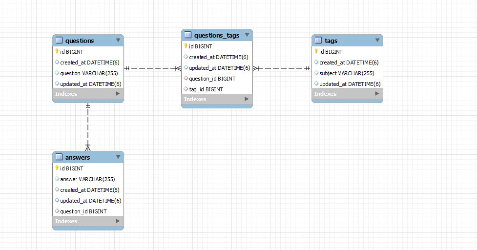
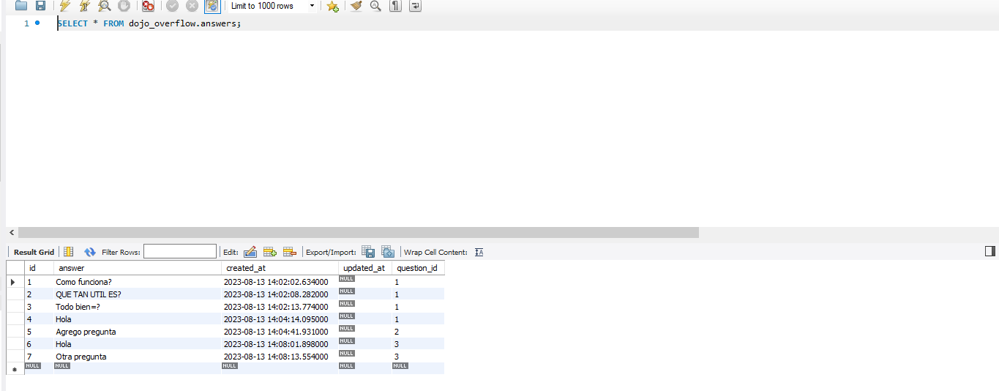
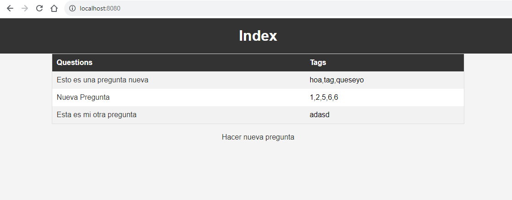
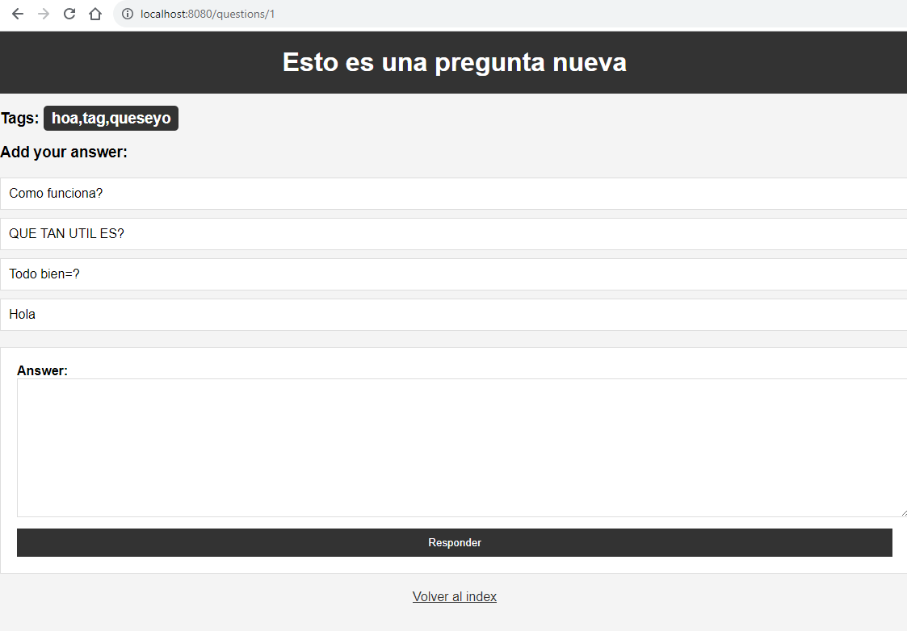
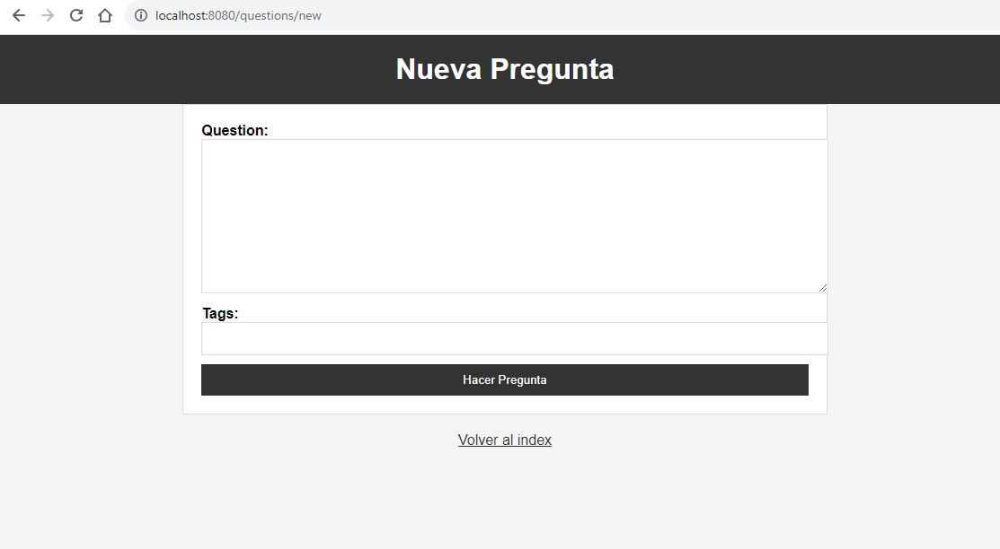

# APP monolítica Dojo Overflow, consultas y respuestas - Coding Dojo Spring Data II

### Tres tablas que se relacionan entre si, de las cuales dos son n:m y deriva en una intermedia.

Se crean consultas con tags y se pueden responder esas consultas o dudas.

### Características

- Relación entre dos tablas en la base de datos SQL.
- Realizado con MVC con Thymeleaf.

  

  
  
  

